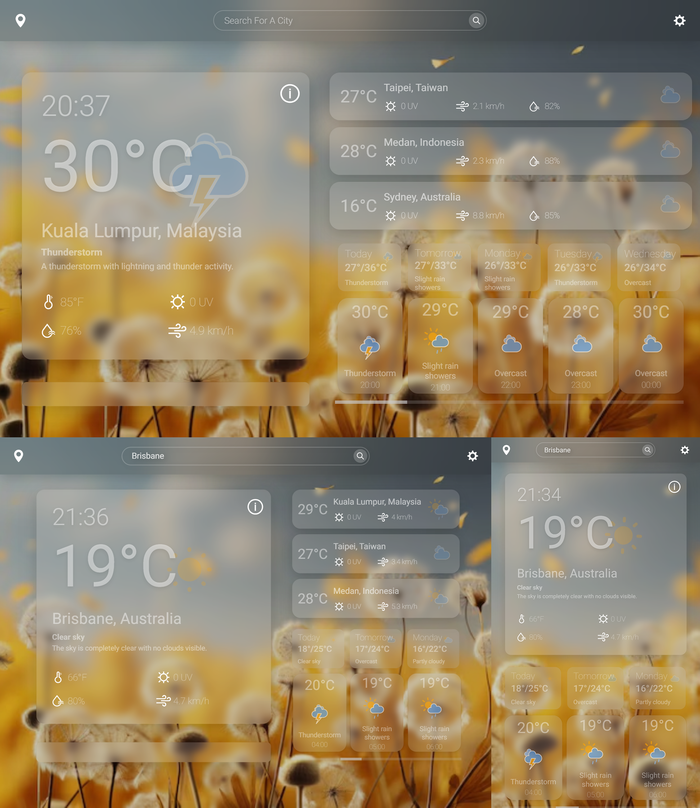

# 🌦️ Weather Web App

A sleek and minimalist weather application focused on frontend development. Built with modern technologies to deliver accurate, real-time weather data with a beautiful UI.

## 🖌️ Design

View the full Figma file 👉 [Here](https://www.figma.com/design/rgIdALutzQTdWGQoRvY6h9/WEATHER?node-id=0-1&t=4NoD52plNayWB60l-1)

## 🧠 Overview

This project is a **frontend-only weather app** built using **Vite + React (JSX)**. It combines multiple APIs to give users detailed insights into current conditions, weekly and hourly forecasts, and environmental metrics.

## 📊 Data Sources

- 🔗 [Meteo](https://www.meteo.com/) – Core weather and forecast data  
- 🔗 [amCharts](https://www.amcharts.com/) – Visual representation of weather trends
- 🔗 [OpenWeatherMap](https://openweathermap.org/) – Visual representation of weather trends

## ✨ Features

- 🌡️ Toggle between **Celsius** and **Fahrenheit**
- 🕐 **24-hour forecast** display with detailed breakdown
- 📅 **7-day forecast** with weather trends
- 💧 Display of **humidity**, **UV index**, and **air quality**
- 📈 Interactive charts powered by amCharts
- 🖼️ Minimalist design with responsive layout

## ⚙️ Tech Stack

- **Frontend**: React (JSX) + Vite, JS
- **Styling**: CSS
- **APIs**: OpenWeatherMap, Meteo, amCharts
- **Deployment**: Vercel

